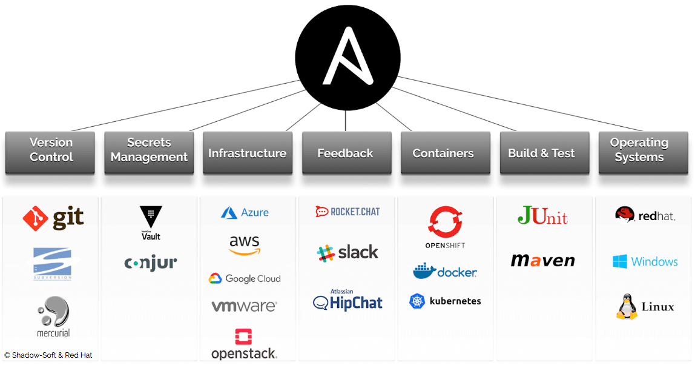

# Ansible

## Indice
[1. Introducción](introduccion.md)

[2. ¿Que es Ansible?.](definicion.md)

[3. Caracteristicas.](caracteristicas.md)

[4. Competidores.](competidores.md)

[5. Arquitectura y componentes](arquitectura.md)

- [Referencias](referencias.md)

## Licencia

